## Task 1
- Write a query to display authors who have written books in multiple genres and group the results by author name.

```sql
Select a.author_id,a.genre
From books a 
Join books b ON a.author_id=b.author_id And a.genre!=b.genre
Join authors On a.author_id=authors.author_id
```

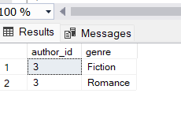


## Task 2
- Write a query to find the books that have the highest sale total for each genre and group the results by genre.
```sql
With sales_CTE
As
(
Select books.book_id as id,title,genre,
DENSE_RANK() over (partition by genre  order by quantity DESC) as rankOfBooks
from books  join sales On books.book_id=sales.sale_id
group by books.book_id,title,genre,quantity
)
Select *
From sales_CTE
Where rankOfBooks = 1;
```
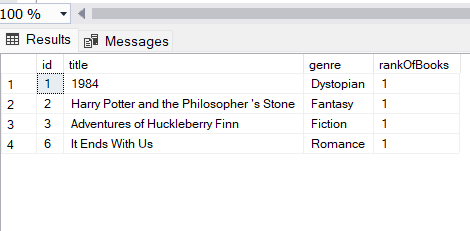


## Task 3
- Write a query to find the average price of books for each author and group the results by author name, only including authors whose average book price is higher than the overall average book price.

```sql
Select books.author_id,Avg(price) as Average , authors.name
From books
join authors on books.author_id=authors.author_id
Group by books.author_id,authors.name
Having Avg(price)> (Select Avg(price)
                       FRom books )
```
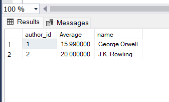


## Task 4
- Write a query to find authors who have sold more books than the average number of books sold per author and group the results by country.

```sql
Select b.author_id, quantity , country 
from sales s
join authors a on  a.author_id=s.sale_id
join books b on b.author_id=a.author_id
group by b.author_id,quantity,country
having Sum(quantity) > (Select Avg(quantity)
                        from sales )
```

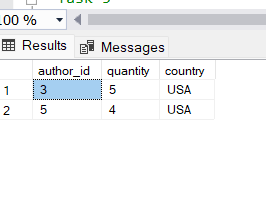


## Task 5
- Write a query to find the top 2 highest-priced books and the total quantity sold for each, grouped by book title.

```sql
Select Top(2) Price, title , quantity 
From books 
Join sales On books.book_id=sales.book_id
order by price Desc
```

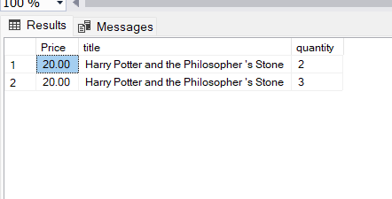


## Task 6
- Write a query to display authors whose birth year is earlier than the average birth year of authors from their country and rank them within their country.

```sql
With bithYear_CTE
As
(Select Avg(Birth_year) as average_birth,country
From authors
group by country
)
Select Author_id,Name,
DENSE_RANK() over (partition by a.country order by birth_year ASC) as rankofAuthors
From authors a inner join bithYear_CTE b
on a.country=b.country
where a.birth_year<b.average_birth
```

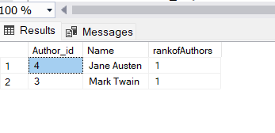

## Task 7
- Write a query to find the authors who have written books in both 'Fiction' and 'Romance' genres and group the results by author name.

```sql
select books.author_id,name
from books
join authors On books.author_id=authors.author_id
Where genre='Fiction' 
Intersect
Select books.author_id,name
from books
join authors On books.author_id=authors.author_id
Where genre='Romance'
```

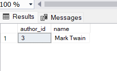

## Task 8
- Write a query to find authors who have never written a book in the 'Fantasy' genre and group the results by country.

```sql
select b.author_id,name,country
from authors a join books b on a.author_id=b.author_id
Except
select b.author_id,name,country
from authors a join books b on a.author_id=b.author_id
Where genre='Fantasy';
```

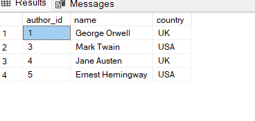


## Task 9
- Write a query to find the books that have been sold in both January and February 2024 and group the results by book title.

```sql
select b.book_id from books b
Join sales s on b.book_id=s.book_id
where sale_date Like '2024-01%'
Intersect
select b.book_id from books b
Join sales s on b.book_id=s.book_id
where sale_date Like '2024-02%';
```

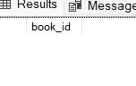


## Task 10
- Write a query to display the authors whose average book price is higher than every book price in the 'Fiction' genre and group the results by author name.

```sql
Select books.author_id,name,Avg(price) as averageBookPrice
from books join authors
on books.author_id=authors.author_id
group by books.author_id,name
having Avg(price) > All(Select price
from books
where genre = 'Fiction')
```

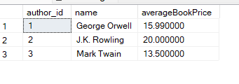


# Section 2: Questions

## Task 1: Stored Procedure for Total Sales by Author
- Create a stored procedure to get the total sales amount for a specific author and write a query to call the procedure for 'J.K. Rowling'.

```sql
Create procedure sales_amount
  @name nvarchar(50)
As
Begin 
    Select a.author_id,name , Sum(total_amount) as total_sum
	From sales s join books b on s.book_id=b.book_id
	join authors a on a.author_id=b.author_id
	group by a.author_id,name
	Having name = @name
END

EXEC sales_amount 'J.K. Rowling'
```

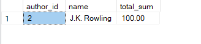


## Task 2: Function to Calculate Total Quantity Sold for a Book
- Create a function to calculate the total quantity sold for a given book title and write a query to use this function for '1984'.

```sql
Create function dbo.TotalQuantity(@title nvarchar(50))
Returns int 
As 
Begin
    Declare  @total_sum int
    Set @total_sum=(Select sum(quantity) as Total_Quantity
	from books b
	Join sales s On b.book_id=s.book_id
	group by s.book_id,title
	having title=@title)
 Return @total_sum ;
End;

Select dbo.TotalQuantity('1984') As Total_Quantity
```
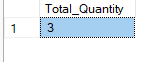
	

## Task 3: View for Best-Selling Books
- Create a view to show the best-selling books (those with total sales amount above $30) and write a query to select from this view.

```sql
Alter View vWBestSelling
As
Select sales.book_id,title,sum(total_amount) as Total_sales
from sales join books on sales.book_id=books.book_id
group by sales.book_id,title;

Select * 
From vWBestSelling
where Total_sales>30
```


## Task 4: Stored Procedure for Average Book Price by Author
- Create a stored procedure to get the average price of books for a specific author and write a query to call the procedure for 'Mark Twain'.

```sql
Create procedure spAvgBookPrice
@name nvarchar(50)
As
Begin
   Begin Transaction 
     Select books.author_id,name,AVG(price) as Average_Price
	 from books join authors on books.author_id=authors.author_id
	 group by books.author_id,name
	 having name=@name
   Commit Transaction
 End
 

 Exec spAvgBookPrice 'Mark Twain'
 ```

 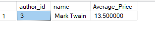


## Task 5: Function to Calculate Total Sales in a Month
- Create a function to calculate the total sales amount in a given month and year, and write a query to use this function for January 2024.

```sql
Alter function dbo.CalculateTotalSales(@date nvarchar(40))
Returns decimal(10,2)
As 
Begin 
  Declare @total decimal(10,2)
  Set @total = (Select sum(total_amount)
  from sales s
  where FORMAT(sale_date,'yyyy-MM') = @date)
return @total;
End;

Select dbo.CalculateTotalSales('2024-01') as Total_Sales
```


## Task 6: View for Authors with Multiple Genres
- Create a view to show authors who have written books in multiple genres and write a query to select from this view.

```sql
Create view vWMultipleGenre
As
 Select a.author_id,a.genre,name
 From books a inner join books b on a.author_id=b.author_id ANd a.genre!=b.genre
 Join authors on a.author_id=authors.author_id;

Select * 
From vWMultipleGenre;
```

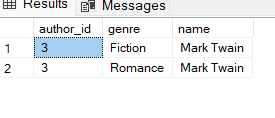


## Task 7: Ranking Authors by Total Sales
- Write a query to rank authors by their total sales amount and display the top 3 authors.

```sql
Select Top(3) a.author_id,a.name , Sum(total_amount) as Total_Sum
,DENSE_RANK() over (order by Sum(total_amount) Desc) as rank
FRom sales s join books b on s.book_id=b.book_id
join authors a on b.author_id=a.author_id
group by a.author_id,name,total_amount
```

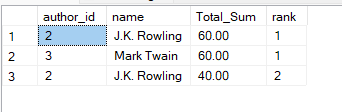


## Task 8: Stored Procedure for Top-Selling Book in a Genre
- Create a stored procedure to get the top-selling book in a specific genre and write a query to call the procedure for 'Fantasy'.

```sql
Create procedure spTopSelling
 @genre nvarchar(40)
As
Begin
   Select Top(1) books.book_id,title,
   DENSE_RANK() over (order by quantity DESC , total_amount DESC) as rank
   From books join sales s on books.book_id=s.book_id 
   Where genre = @genre
End

EXEC spTopSelling 'Fiction' 
```

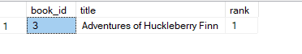


## Task 9: Function to Calculate Average Sales Per Genre
- Create a function to calculate the average sales amount for books in a given genre and write a query to use this function for 'Romance'.

```sql
Create function dbo.CalculateAverageSales(@genre nvarchar(50))
Returns decimal(10,2)
As 
Begin 
Declare @average decimal(10,2)
   Set @average= (Select Avg(total_amount) as Average
   from sales s join books b on s.book_id=b.book_id
   where genre = @genre) 

 Return @average;
 END;

 select dbo.CalculateAverageSales('Romance') as Average
 ```

 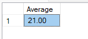