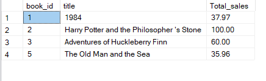
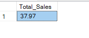
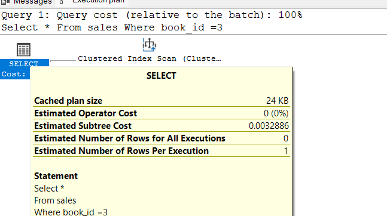

## Task 1
- Write a query to display authors who have written books in multiple genres and group the results by author name.

```sql
Select a.author_id,a.genre
From books a 
Join books b ON a.author_id=b.author_id And a.genre!=b.genre
Join authors On a.author_id=authors.author_id
```


## Task 2
- Write a query to find the books that have the highest sale total for each genre and group the results by genre.
```sql
With sales_CTE
As
(
Select books.book_id as id,title,genre,
DENSE_RANK() over (partition by genre  order by quantity DESC) as rankOfBooks
from books  join sales On books.book_id=sales.sale_id
group by books.book_id,title,genre,quantity
)
Select *
From sales_CTE
Where rankOfBooks = 1;
```


## Task 3
- Write a query to find the average price of books for each author and group the results by author name, only including authors whose average book price is higher than the overall average book price.

```sql
Select books.author_id,Avg(price) as Average , authors.name
From books
join authors on books.author_id=authors.author_id
Group by books.author_id,authors.name
Having Avg(price)> (Select Avg(price)
                       FRom books )
```


## Task 4
- Write a query to find authors who have sold more books than the average number of books sold per author and group the results by country.

```sql
Select b.author_id, quantity , country 
from sales s
join authors a on  a.author_id=s.sale_id
join books b on b.author_id=a.author_id
group by b.author_id,quantity,country
having Sum(quantity) > (Select Avg(quantity)
                        from sales )
```


## Task 5
- Write a query to find the top 2 highest-priced books and the total quantity sold for each, grouped by book title.

```sql
Select Top(2) Price, title , quantity 
From books 
Join sales On books.book_id=sales.book_id
order by price Desc
```


## Task 6
- Write a query to display authors whose birth year is earlier than the average birth year of authors from their country and rank them within their country.

```sql
With bithYear_CTE
As
(Select Avg(Birth_year) as average_birth,country
From authors
group by country
)
Select Author_id,Name,
DENSE_RANK() over (partition by a.country order by birth_year ASC) as rankofAuthors
From authors a inner join bithYear_CTE b
on a.country=b.country
where a.birth_year<b.average_birth
```


## Task 7
- Write a query to find the authors who have written books in both 'Fiction' and 'Romance' genres and group the results by author name.

```sql
select books.author_id,name
from books
join authors On books.author_id=authors.author_id
Where genre='Fiction' 
Intersect
Select books.author_id,name
from books
join authors On books.author_id=authors.author_id
Where genre='Romance'
```


## Task 8
- Write a query to find authors who have never written a book in the 'Fantasy' genre and group the results by country.

```sql
select b.author_id,name,country
from authors a join books b on a.author_id=b.author_id
Except
select b.author_id,name,country
from authors a join books b on a.author_id=b.author_id
Where genre='Fantasy';
```


## Task 9
- Write a query to find the books that have been sold in both January and February 2024 and group the results by book title.

```sql
select b.book_id from books b
Join sales s on b.book_id=s.book_id
where sale_date Like '2024-01%'
Intersect
select b.book_id from books b
Join sales s on b.book_id=s.book_id
where sale_date Like '2024-02%';
```


## Task 10
- Write a query to display the authors whose average book price is higher than every book price in the 'Fiction' genre and group the results by author name.

```sql
Select books.author_id,name,Avg(price) as averageBookPrice
from books join authors
on books.author_id=authors.author_id
group by books.author_id,name
having Avg(price) > All(Select price
from books
where genre = 'Fiction')
```


# Section 2: Questions

## Task 1: Stored Procedure for Total Sales by Author
- Create a stored procedure to get the total sales amount for a specific author and write a query to call the procedure for 'J.K. Rowling'.

```sql
Create procedure sales_amount
  @name nvarchar(50)
As
Begin 
    Select a.author_id,name , Sum(total_amount) as total_sum
	From sales s join books b on s.book_id=b.book_id
	join authors a on a.author_id=b.author_id
	group by a.author_id,name
	Having name = @name
END

EXEC sales_amount 'J.K. Rowling'
```


## Task 2: Function to Calculate Total Quantity Sold for a Book
- Create a function to calculate the total quantity sold for a given book title and write a query to use this function for '1984'.

```sql
Create function dbo.TotalQuantity(@title nvarchar(50))
Returns int 
As 
Begin
    Declare  @total_sum int
    Set @total_sum=(Select sum(quantity) as Total_Quantity
	from books b
	Join sales s On b.book_id=s.book_id
	group by s.book_id,title
	having title=@title)
 Return @total_sum ;
End;

Select dbo.TotalQuantity('1984') As Total_Quantity
```

	

## Task 3: View for Best-Selling Books
- Create a view to show the best-selling books (those with total sales amount above $30) and write a query to select from this view.

```sql
Alter View vWBestSelling
As
Select sales.book_id,title,sum(total_amount) as Total_sales
from sales join books on sales.book_id=books.book_id
group by sales.book_id,title;

Select * 
From vWBestSelling
where Total_sales>30
```



## Task 4: Stored Procedure for Average Book Price by Author
- Create a stored procedure to get the average price of books for a specific author and write a query to call the procedure for 'Mark Twain'.

```sql
Create procedure spAvgBookPrice
@name nvarchar(50)
As
Begin
   Begin Transaction 
     Select books.author_id,name,AVG(price) as Average_Price
	 from books join authors on books.author_id=authors.author_id
	 group by books.author_id,name
	 having name=@name
   Commit Transaction
 End
 

 Exec spAvgBookPrice 'Mark Twain'
 ```

 


## Task 5: Function to Calculate Total Sales in a Month
- Create a function to calculate the total sales amount in a given month and year, and write a query to use this function for January 2024.

```sql
Alter function dbo.CalculateTotalSales(@date nvarchar(40))
Returns decimal(10,2)
As 
Begin 
  Declare @total decimal(10,2)
  Set @total = (Select sum(total_amount)
  from sales s
  where FORMAT(sale_date,'yyyy-MM') = @date)
return @total;
End;

Select dbo.CalculateTotalSales('2024-01') as Total_Sales
```



## Task 6: View for Authors with Multiple Genres
- Create a view to show authors who have written books in multiple genres and write a query to select from this view.

```sql
Create view vWMultipleGenre
As
 Select a.author_id,a.genre,name
 From books a inner join books b on a.author_id=b.author_id ANd a.genre!=b.genre
 Join authors on a.author_id=authors.author_id;

Select * 
From vWMultipleGenre;
```


## Task 7: Ranking Authors by Total Sales
- Write a query to rank authors by their total sales amount and display the top 3 authors.

```sql
Select Top(3) a.author_id,a.name , Sum(total_amount) as Total_Sum
,DENSE_RANK() over (order by Sum(total_amount) Desc) as rank
FRom sales s join books b on s.book_id=b.book_id
join authors a on b.author_id=a.author_id
group by a.author_id,name,total_amount
```


## Task 8: Stored Procedure for Top-Selling Book in a Genre
- Create a stored procedure to get the top-selling book in a specific genre and write a query to call the procedure for 'Fantasy'.

```sql
Create procedure spTopSelling
 @genre nvarchar(40)
As
Begin
   Select Top(1) books.book_id,title,
   DENSE_RANK() over (order by quantity DESC , total_amount DESC) as rank
   From books join sales s on books.book_id=s.book_id 
   Where genre = @genre
End

EXEC spTopSelling 'Fiction' 
```


## Task 9: Function to Calculate Average Sales Per Genre
- Create a function to calculate the average sales amount for books in a given genre and write a query to use this function for 'Romance'.

```sql
Create function dbo.CalculateAverageSales(@genre nvarchar(50))
Returns decimal(10,2)
As 
Begin 
Declare @average decimal(10,2)
   Set @average= (Select Avg(total_amount) as Average
   from sales s join books b on s.book_id=b.book_id
   where genre = @genre) 

 Return @average;
 END;

 select dbo.CalculateAverageSales('Romance') as Average
 ```

 


 
# Section 3: Stored Procedures with Transactions and Validations


## Task 1 : Add New Book and Update Author's Average Price
- Create a stored procedure that adds a new book and updates the average price of books for the author.Ensure the price is positive, use transactions to ensure data integrity, and return the new average price.

```sql
Create procedure spAveragePrice
   @book_id int , @title nvarchar(50), @author_id int, @genre nvarchar(50) , @price int 
As 
  Begin 
     Begin Transaction;
	   Begin Try 
	       if @price < 0 
		      Throw 60000 , 'Entered price not valid' , 1;

			Insert into books Values (@book_id,@title,@author_id,@genre,@price);

			Select Avg(price) as NewAverage
			FRom books 
			GRoup by author_id
			having author_id=@author_id 

		commit transaction;
	End try

	Begin catch 
	   Rollback;
	   print Concat('Error number is:',Error_number());
			print Error_message();
			print Error_State();
	End catch
End


EXEC spAveragePrice 8 , 'Place of Illusions' , 2 , 'Fiction', -12;
```


## Task 2 : Delete Book and Update Author's Total Sales
-Create a stored procedure that deletes a book and updates the author's total sales. 
Ensure the book exists, use transactions to ensure data integrity, and return the new total sales for the author.

```sql
Create procedure spDeleteBook
@book_id int
As
Begin 
   begin transaction ;
       begin try 
	      if not exists (Select book_id 
		                 from sales 
						 where book_id=@book_id)
			Throw 60000 , 'Book doesnt exist',1

			Declare @author_id int = (Select author_id 
			                          from books
									  where book_id=@book_id)


			Delete from sales
			Where book_id=@book_id;

			Delete from books
			where book_id=@book_id;

			Select sum(quantity) as Total_sales
			from sales Join books
			on sales.book_id=books.book_id
			group by author_id
			having author_id=@author_id

	   commit transaction;
	   end try 

	   begin catch 
	     Rollback;
		 print Concat('Error number :',Error_Number());
		 print Error_Message();
		 print Error_State();
	  End catch
End
	  


EXEC spDeleteBook 6
```


## Transfer Book Sales to Another Book
- Task 3 :Create a stored procedure that transfers sales from one book to another and updates the total sales for both books.
Ensure both books exist, use transactions to ensure data integrity, and return the new total sales for both books.

```sql
Create procedure spTransferSales
  @bookId1 int , @bookId2 int ,@amount decimal(10,2)
As 
Begin 
   Begin Transaction 
     Begin try 
	     if not exists (Select book_id 
		                from books
						where book_id = @bookId1 Or book_id=@bookId2)
		 Throw 60000,'Book doesnt exist',1
												  	      
		Update sales
		set total_amount = (Select total_amount+ @amount
		                                         from sales
												 where book_id=@bookId2)
		Where book_id=@bookId2

		Update sales
		set total_amount = (Select total_amount- @amount
		                                         from sales
												 where book_id=@bookId1)
		Where book_id=@bookId1

	commit transaction;
	End try

	begin catch 
	  rollback;
	  print CONCAT('Error number:',ERROR_NUMBER());
	  print CONCAT('Error message:',ERROR_MESSAGE());
	  print CONCAT('Error state:',ERROR_STATE());
	end catch
End


EXEC spTransferSales 1,3,10
```


## Task 4 : Create a stored procedure that adds a sale and updates the total quantity sold for the book. 
- Ensure the quantity is positive, use transactions to ensure data integrity, and return the new total quantity sold for the book.

```sql
Create procedure spUpdateQuantity
@sale_id int,@book_id int,@sale_date date,@quantity int
As
Begin 
  Begin transaction;
    begin try
	   if @quantity<=0
	     throw 60000,'Enter valid quantity',1;


	  Declare @newPrice int ;
	  Set @newPrice = (Select price*@quantity
	                   from books
					   where book_id=@book_id);

	   insert into sales
	   values (@sale_id,@book_id,@sale_date,@quantity,@newPrice)

	   Select book_id,Sum(quantity) as Total_Quantity
	   from sales
	   group by book_id
	   having book_id=@book_id

	   commit transaction
	   end try

	   begin catch
	   rollback;
		  print CONCAT('Error number',ERROR_NUMBER());
		  print CONCAT('Error message',ERROR_MESSAGE());
		  print CONCAT('Error state',ERROR_STATE());
		end catch
End
	    
EXEC spUpdateQuantity  7,2,'2024-03-15',3
```


## Task 5 :Create a stored procedure that updates the price of a book and recalculates the average price of books for the author. 
- Ensure the price is positive, use transactions to ensure data integrity, and return the new average price.

```sql
Create procedure spUpdatePrice
  @book_id int , @updatePrice decimal(10,2)
As
Begin
  Begin transaction;
    Begin try
	    if @updatePrice<=0
		  throw 60000,'Price must be positive',1;

		Update books
		Set price=@updatePrice
		where book_id=@book_id

		Select author_id,Avg(price) as Average
		from books
		group by author_id
		having author_id = (Select author_id
		                    from books
							where book_id=@book_id)

		commit transaction;
		end try

		begin catch
		  rollback;
		  print CONCAT('Error number',ERROR_NUMBER());
		  print CONCAT('Error message',ERROR_MESSAGE());
		  print CONCAT('Error state',ERROR_STATE());
		end catch
End

EXEC spUpdatePrice 3,12;
```


# Section 4: Advanced SQL Concepts

## 1.Inline Table-Valued Function (iTVF)
- Create an inline table-valued function that returns the total sales amount for each book and use it in a query to display the results.

```sql
Create function dbo.CalculateAverage ()
Returns table
As
  Return(Select book_id,Sum(total_amount) as Total_Sales
          from sales
		  group by book_id
		  );

Select * from dbo.CalculateAverage()
```


## 2.Multi-Statement Table-Valued Function (MTVF)
- Create a multi-statement table-valued function that returns the total quantity sold for each genre and use it in a query to display the results

```sql
Create function dbo.TotalQuantityOnGenre()
Returns @tableForTotalQuantity table (genre nvarchar(50),total_quantity int)
As
  Begin 
      Insert into @tableForTotalQuantity
      Select genre, Sum(Quantity) As Total_Quantity
	  From sales Join books On sales.book_id=books.book_id
	  Group by genre
 
  Return 
End;


Select * from dbo.TotalQuantityOnGenre();
```


## 3.Scalar Function
- Create a scalar function that returns the average price of books for a given author and use it in a query to display the average price for 'Jane Austen'.

```sql
Create function dbo.CalculateAvgPrice(@Author_Name nvarchar(50))
Returns decimal(10,2)
As 
  Begin 
    Declare @Avg Decimal(10,2) 
	Set @Avg = (Select Avg(price)
	            From books b
				join authors a on b.author_id=a.author_id
				group by b.author_id,name
				having name=@Author_Name)
	Return @Avg;
	End;

Select authors.author_id,authors.name,dbo.CalculateAvgPrice('Jane Austen') As Average
From books join authors on books.author_id=authors.author_id
where name = 'Jane Austen'

```


## 4.Stored Procedure for Books with Minimum Sales
- Create a stored procedure that returns books with total sales above a specified amount and use it to display books with total sales above $40.

```sql
create procedure spMinimumSales
  @amount decimal(10,2)
As
Begin
    Select sales.book_id,title,sum(total_amount)
	from sales join books on books.book_id=sales.book_id
	group by sales.book_id,title
	having sum(total_amount) > @amount
End


Exec spMinimumSales 40
```


## 5.Indexing for Performance Improvement
- Create an index on the sales table to improve query performance for queries filtering by book_id.

```sql
Create NONCLUSTERED INDEX ix_OnBookId on sales(book_id);


Select *
From sales
Where book_id =3
```




## 6.Export Data as XML
- Write a query to export the authors and their books as XML.

```sql
Select 
authors.Author_id ,
Name,
book_id as [Books/Book_Id],
Title as [Books/Title]
from books join authors on authors.author_id=books.author_id
for XML Path ('Authors');
```


## 7.Export Data as JSON
- Write a query to export the authors and their books as JSON.

```sql
Select 
authors.Author_id ,
Name,
book_id as 'Books.Book_Id',
Title as 'Books.Title'
from books join authors on authors.author_id=books.author_id
for JSON Path ,Root('Authors');
```


## 8.Scalar Function for Total Sales in a Year
- Create a scalar function that returns the total sales amount in a given year and use it in a query to display the total sales for 2024.

```sql
Create function dbo.CalculateSalesYear(@year nvarchar(20))
Returns decimal(10,2)
As
Begin
   Return (Select sum(total_amount) as Total_Sales
            from sales
			Group by FORMAT(sale_date,'yyyy')
			having FORMAT(sale_date,'yyyy')=@year);
End;


Select dbo.CalculateSalesYear(2024) as total_sales
```


## 9.Stored Procedure for Genre Sales Report
- Create a stored procedure that returns a sales report for a specific genre, including total sales and average sales, and use it to display the report for 'Fiction'.

```sql
Create procedure spGenreSalesReport
  @genre nvarchar(30)
  As
  Begin 
     Select genre,sum(total_amount) as Total_Sales, Avg(Total_amount) as Average_Sales
	 from sales join books on sales.book_id=books.book_id
	 group by genre
	 having genre = @genre;
End;

Exec spGenreSalesReport 'Fiction'
```


## 10.Ranking Books by Average Rating (assuming a ratings table)
- Write a query to rank books by their average rating and display the top 3 books. Assume a ratings table with book_id and rating columns.

```sql
Select Top(3) book_id,Avg(rating) as Average,
DENSE_RANK() over (Order by Avg(rating) DESC) as rank
from ratings
group by book_id;
```

# Section 5: 
## Questions for Running Total and Running Average with OVER Clause

- 1.Running Total of Sales Amount by Book
  - Create a view that displays each sale for a book along with the running total of the sales amount using the OVER clause.

```sql
Alter view vWTotalSales
As
Select sale_id,sales.book_id,title,sale_date,total_amount, Sum(total_amount) over (partition by sales.book_id Order by sale_id Rows between unbounded preceding and current row) as Running_total
from sales join books on sales.book_id=books.book_id


Select * 
from vWTotalSales
```


## 2.Running Total of Sales Quantity by Author
- Create a view that displays each sale for an author along with the running total of the sales quantity using the OVER clause.
```sql
Create view vWSalesQuantity
As
Select sale_id,sales.book_id,books.author_id,name,quantity,Sum(quantity) over (partition by books.author_id order by quantity rows between unbounded preceding and current row) as Running_Total
from sales join books on sales.book_id=books.book_id
join authors on books.author_id=authors.author_id


select *
from vWSalesQuantity
```


## 3.Running Total and Running Average of Sales Amount by Genre
- Create a view that displays each sale for a genre along with both the running total and the running average of the sales amount using the OVER clause.
```sql
Create view vWSalesAmountByGenre
As
   Select sale_id,sales.book_id,genre,sale_date,quantity,total_amount
          ,Sum(total_amount) over (partition by genre order by total_amount rows between unbounded preceding and current row) as Running_Total
		  ,Avg(total_amount) over (partition by genre order by total_amount rows between unbounded preceding and current row) as Running_Average
   From sales join books on sales.book_id=books.book_id


select * 
from vWSalesAmountByGenre;
```


# Section 6: Triggers

## 1.Trigger to Update Total Sales After Insert on Sales Table
- Create a trigger that updates the total sales for a book in the books table after a new record is inserted into the sales table.
```sql
Create trigger trg_TotalSales
on sales
After insert
As
Begin
   Declare @newAMount decimal(10,2) = (select total_amount
                                       from inserted)
   Update books
   set total_sales = total_sales+@newAMount
   where book_id=(Select book_id
                   from inserted)
End

insert into sales values(8,1,'2024-05-15',2,31.98)

```


## 2.Trigger to Log Deletions from the Sales Table
- Create a trigger that logs deletions from the sales table into a sales_log table with the sale_id, book_id, and the delete_date.

```sql
Create trigger trg_Deletion
on Sales
After Delete
As
Begin 
   Insert into sales_log
   Select sale_id,book_id,GetDate()
   from deleted
End

Delete from sales where sale_id=8
Select * from sales_log
```


## 3.Trigger to Prevent Negative Quantity on Update
- Create a trigger that prevents updates to the sales table if the new quantity is negative.